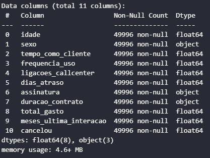
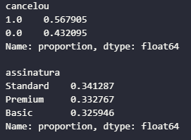
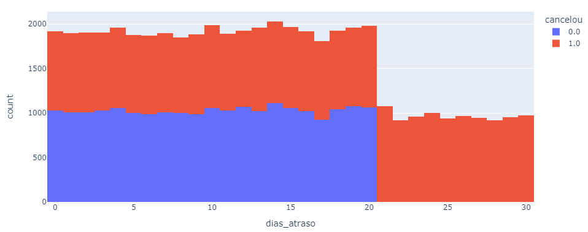
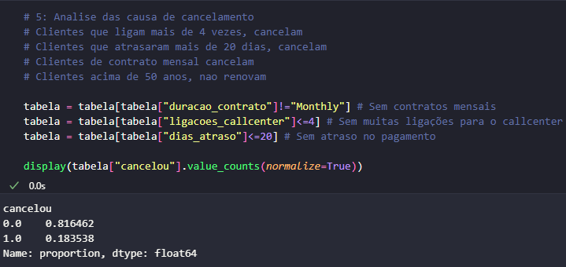

# Projeto de analise de dados
## Cancelamentos de planos

Este projeto consiste na analise de dados dos clientes de uma empresa que tem notado um grande numero de cancelamentos. A analise ajuda a entender os cancelamentos.

## Dados
A analise será feita sobre os dados de clientes em diferentes planos, contando com as variaveis exibidas a seguir.

O dataset traz variaveis com informações de cancelamento dos clientes na seguinte proporção.

## Analise
Algumas analises se destacaram de cara, mostrando forte ligação com a variavel *cancelou*. Veremos isso com algumas ilustrações a seguir.

O numero de ligações pro Call Center

O pagamento atrasado (numero de dias)

Dessa analise, é possivel ver a criticidade do atraso e do numero de ligações para o Call Center, se mostrando como indicadores de cancelamento. Sendo o grande objetivo fidelizar o cliente e minimizar o cancelamento, essas variaveis merecem atenção juntamento com o tipo de plano.
