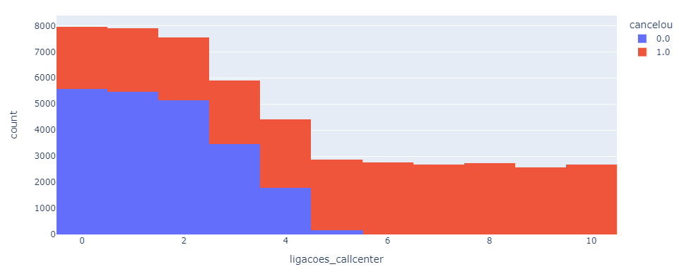

# Projeto de Análise de Dados
## Cancelamentos de Planos

Este projeto consiste na análise de dados dos clientes de uma empresa que tem notado um grande número de cancelamentos dos planos contratados por seus clientes. Essa análise ajuda a entender os cancelamentos.

## Dados
A análise será feita sobre as informações de clientes em diferentes planos, contando com as variáveis exibidas a seguir.

### Proporção
Para garantir a representação é preciso conhecer a porporção dos dados disponiveis.

Note que existe uma boa distribuição entre os planos e os casos de cancelamento ou não, o que é crucial para uma boa análise sem viés.

## Análise
Algumas análises se destacaram logo, mostrando forte ligação com a variavel *cancelou*. Veremos isso com algumas ilustrações a seguir.

### Número de Ligações pro Call Center
Um alto número de ligações pro Call Center claramente representa um problema, uma vez que o cliente não deve ficar ligando se estiver tudo certo.

### Atraso no Pagamento
O atraso no pagamento também merece atenção, já que configura indício de tendência para inadimplência.

### Analise Proposital
Dessa análise, é possivel observar a criticidade do atraso no pagamento e do número de ligações para o Call Center, se mostrando como indicadores de cancelamento. Como o grande objetivo é fidelizar o cliente e minimizar o cancelamento, essas variaveis merecem atenção juntamente com o tipo de plano.

Com essa análise, conclui que a fidelização dos clientes pode ser melhorada:
 - Promoção de upgrade de planos mensais para anuais;
 - Soluções ágeis para problemas relatados ao Call Center;
 - Atenção em pagamentos atrasados com frequência.